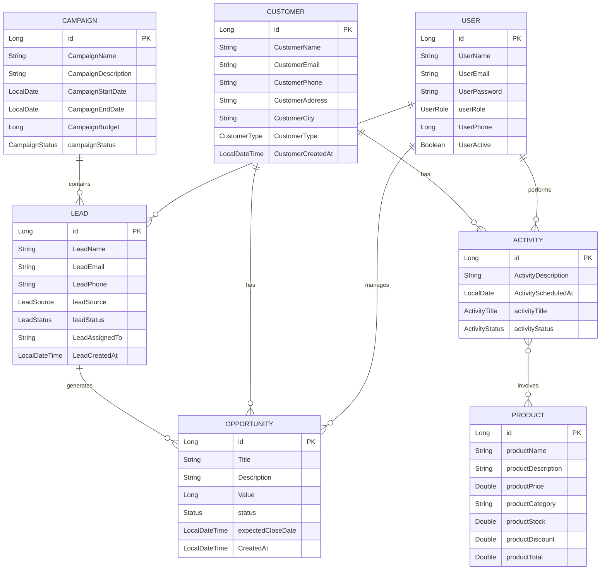
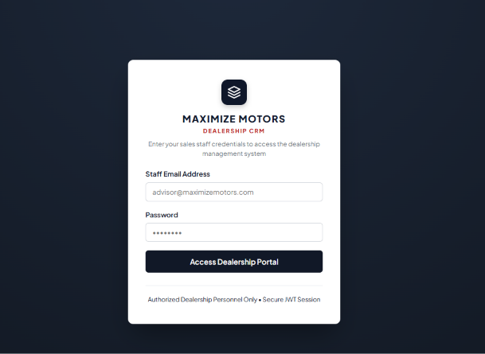
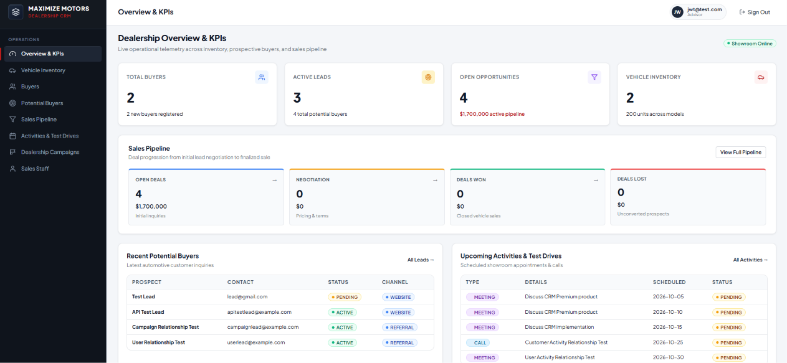
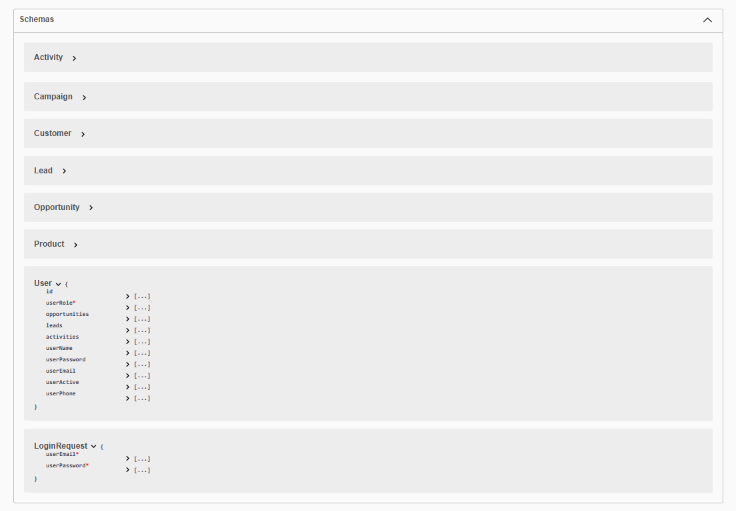
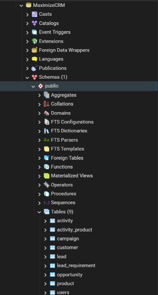

# MaximizeCRM

[](https://github.com/Agrima0408/MaximizeCRM/actions/workflows/maven-build.yml)

MaximizeCRM is a Customer Relationship Management application for managing customers, leads, opportunities, campaigns, activities, and products through a secure REST API and a web frontend.

---

## Features

- User registration and login with JWT-based authentication
- CRUD for customers, leads, opportunities, campaigns, activities, and products
- Linked CRM data: users manage leads and opportunities, campaigns contain leads, leads generate opportunities
- Input validation and global exception handling
- Swagger/OpenAPI documentation for every endpoint

---

## Tech Stack

| Layer | Technologies |
|---|---|
| Backend | Java 17, Spring Boot 3.2.5, Spring Web, Spring Data JPA, Spring Security, Jakarta Bean Validation, JWT, Lombok, Maven |
| Database | PostgreSQL 17, Hibernate / JPA |
| Frontend | HTML, CSS, JavaScript |
| Tools | IntelliJ IDEA, Git, GitHub, GitHub Actions, Swagger / OpenAPI |

---

## Project Structure

```text
MaximizeCRM
│
├── .github/
│   └── workflows/
│       └── maven-build.yml
│
├── database/
│   ├── database.yml
│   ├── Project-PPT
│   └── Project-Report
│
├── MaximizeCRM Backend/
│   ├── src/
│   ├── pom.xml
│   └── mvnw
│
├── MaximizeCRM Frontend/
│   └── Frontend files
│
└── README.md
```

---

# ER Diagram

The following diagram represents the main entities and relationships currently implemented in the backend.



### Entity Relationships

| Relationship | Type |
|---|---|
| User → Lead | One-to-Many |
| User → Opportunity | One-to-Many |
| User → Activity | One-to-Many |
| Customer → Opportunity | One-to-Many |
| Customer → Activity | One-to-Many |
| Campaign → Lead | One-to-Many |
| Lead → Opportunity | One-to-Many |
| Activity ↔ Product | Many-to-Many |

The `Activity` and `Product` relationship uses the `activity_product` join table.

> **Note:** `UserRole` is part of the User entity, but role-based authorization is not currently enforced by the security configuration. The application currently uses JWT authentication for protected endpoints.

---

# Authentication & Security

MaximizeCRM uses JWT-based authentication with Spring Security.

### Login

```text
POST /api/auth/login
```

A successful login returns a JWT token, which is sent with protected requests:

```text
Authorization: Bearer <JWT_TOKEN>
```

The current security configuration provides:

- Public user registration and login endpoints
- CRM endpoints protected by a valid JWT
- Public access to Swagger/OpenAPI
- Stateless session management
- An unauthorized response for invalid or missing authentication

<!-- TODO: confirm whether Swagger is really public or needs a token, and correct the bullet above if not. -->

---

# API Documentation

Swagger/OpenAPI is integrated into the backend for API documentation and testing.

After starting the backend, open:

```text
http://localhost:8081/swagger-ui/index.html
```

### API Modules

| Module | Base path | Purpose |
|---|---|---|
| Authentication | `/api/auth` | Login and JWT generation |
| Users | `/api/users` | User registration and management |
| Customers | `/api/customers` | Customer information |
| Leads | `/api/leads` | Lead management and tracking |
| Opportunities | `/api/opportunities` | Sales opportunities |
| Campaigns | `/api/campaigns` | Campaign management |
| Activities | `/api/activities` | CRM activities |
| Products | `/api/products` | Product catalogue |

<!-- TODO: the base paths above (except /api/auth) are placeholders. Replace them with the real paths from your controllers. -->

### Example: login and call a protected endpoint

```bash
# 1. Log in and get a token
curl -X POST http://localhost:8081/api/auth/login \
  -H "Content-Type: application/json" \
  -d '{"email": "user@example.com", "password": "yourPassword"}'

# 2. Use the token on a protected endpoint
curl http://localhost:8081/api/customers \
  -H "Authorization: Bearer <JWT_TOKEN>"
```

<!-- TODO: match the login request fields and add a sample response copied from Swagger. -->

---

# Build & CI

The backend uses Maven and includes the Maven Wrapper.

```bash
# Linux / macOS
./mvnw clean verify

# Windows
.\mvnw.cmd clean verify
```

The project does not yet have an automated unit or integration test suite, so `clean verify` confirms that the backend builds, not that behaviour is tested.

The GitHub Actions workflow (`.github/workflows/maven-build.yml`) runs on pushes to `main` and on pull requests targeting `main`. It checks out the repository, sets up Java 17, caches Maven dependencies, and runs `clean verify`.

---

# Run the Backend

## Prerequisites

- Java 17
- PostgreSQL
- Git

### 1. Clone the repository

```bash
git clone https://github.com/Agrima0408/MaximizeCRM.git
cd MaximizeCRM
```

### 2. Create the PostgreSQL database

Create a database named:

```text
MaximizeCRM
```

The database structure is documented in `database/database.yml`.

### 3. Configure the backend

Open:

```text
MaximizeCRM Backend/src/main/resources/application.properties
```

and set your local PostgreSQL credentials and JWT secret. Do not commit real passwords or secrets; use environment variables where possible.

```properties
spring.datasource.url=jdbc:postgresql://localhost:5432/MaximizeCRM
spring.datasource.username=postgres
spring.datasource.password=${DB_PASSWORD}

jwt.secret=${JWT_SECRET}

spring.jpa.hibernate.ddl-auto=update
server.port=8081
```

<!-- TODO: replace jwt.secret with the exact property name your code reads, and add the expiry property if you have one. -->

### 4. Start the backend

From inside the `MaximizeCRM Backend` folder:

```bash
# Linux / macOS
./mvnw spring-boot:run

# Windows
.\mvnw.cmd spring-boot:run
```

The backend runs on `http://localhost:8081`.

---

# Frontend

The frontend is in the `MaximizeCRM Frontend` folder. Start the backend first, then open the main HTML file in a browser. The frontend calls the backend at `http://localhost:8081`.

<!-- TODO: name the exact file to open (for example index.html or login.html). If you open it as a file:// page, confirm CORS is configured in the backend, otherwise the browser will block the API calls. If it is not, serve it with a simple local server or add CORS config, and say so here. -->

---

## Screenshots

### Login



### Dashboard / Main Interface



### Swagger API Documentation



### Database



---

# Database Documentation

The `database` folder contains the database documentation:

```text
database/
├── database.yml
├── Project-PPT
└── Project-Report
```

`database.yml` documents the PostgreSQL database and the main tables used by the application:

```text
users
product
opportunity
lead_requirement
lead
customer
campaign
activity_product
activity
```

<!-- TODO: lead_requirement is not in the ER diagram or the relationships table. Add it there, or add one line here explaining what it stores. -->
